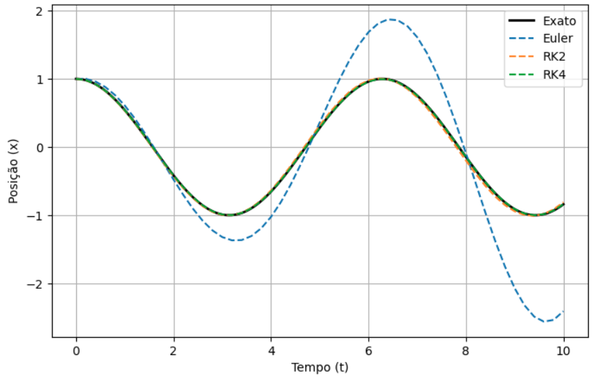
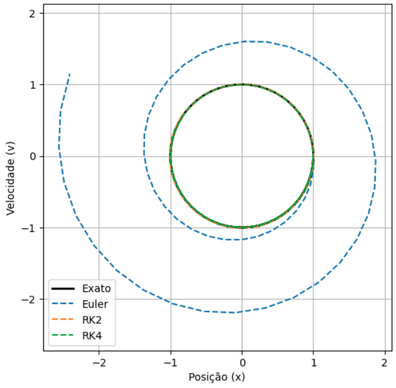
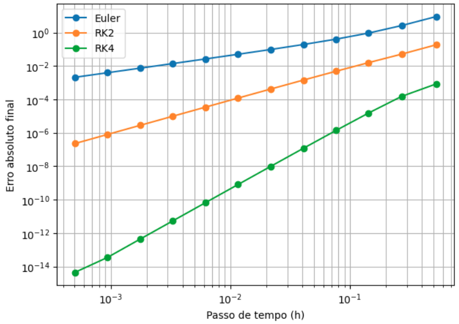

# Integração Numérica do Oscilador Harmônico: Euler, RK2 e RK4

Estudo comparativo de três métodos explícitos de integração numérica, Euler, Runge-Kutta de 2ª ordem (RK2) e Runge-Kutta de 4ª ordem (RK4), aplicados ao oscilador harmônico simples, com verificação empírica da ordem de convergência de cada método.

## Motivação

O oscilador harmônico simples é um dos poucos sistemas dinâmicos com solução analítica fechada e, por isso, é um caso de teste natural para avaliar a acurácia de integradores numéricos: qualquer discrepância entre a solução numérica e a exata pode ser atribuída inteiramente ao erro de truncamento do método, sem contaminação por erros de modelagem.

## Formulação do problema

O sistema físico é descrito pela equação de movimento

```
ẍ + ω² x = 0
```

reescrita como um sistema de primeira ordem no espaço de fase (x, v):

```
ẋ = v
v̇ = -ω² x
```

com solução analítica exata

```
x(t) = x₀ cos(ωt) + (v₀/ω) sin(ωt)
v(t) = -x₀ ω sin(ωt) + v₀ cos(ωt)
```

usada como referência para o cálculo do erro em cada método.

## Métodos implementados

| Método | Ordem local | Ordem global | Avaliações de derivada por passo |
|---|---|---|---|
| Euler explícito | O(h²) | O(h) | 1 |
| RK2 (ponto médio) | O(h³) | O(h²) | 2 |
| RK4 (clássico) | O(h⁵) | O(h⁴) | 4 |

A ordem global de cada método é verificada empiricamente na seção de resultados, ajustando uma lei de potência ao erro absoluto final em função do passo `h`.

## Estrutura

```
.
├── oscilador_euler_rk2_rk4.ipynb   # Implementação dos métodos e análise de convergência
└── imagens/   # gráficos gerados  
```

## Resultados

### Trajetória temporal

A posição `x(t)` obtida por cada método é comparada com a solução exata. O erro de fase do método de Euler cresce visivelmente ao longo do tempo, enquanto RK2 e RK4 permanecem indistinguíveis da solução analítica na escala do gráfico.



### Espaço de fase

No plano (x, v), a solução exata descreve uma órbita fechada, refletindo a conservação de energia do sistema. RK2 e RK4 preservam essa órbita com boa fidelidade; o método de Euler, por outro lado, espirala para fora, evidência direta de que o método introduz um crescimento espúrio de energia a cada passo, consequência de sua natureza não simplética.



### Análise de convergência

O erro absoluto final é calculado para uma faixa de passos `h`, em escala log-log. As inclinações das retas de ajuste correspondem às ordens de convergência esperadas, aproximadamente 1, 2 e 4 para Euler, RK2 e RK4, respectivamente, confirmando empiricamente a análise teórica de erro de truncamento de cada método.



## Requisitos

- Python 3.8+
- NumPy
- Matplotlib
